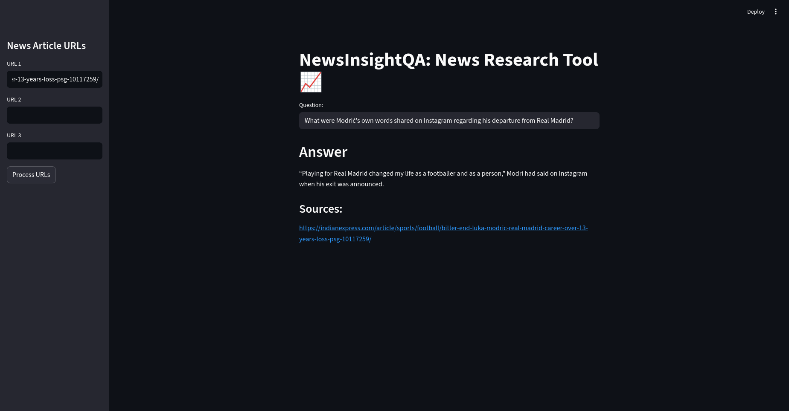

# 📰 NewsInsightQA - News Article Question Answering Tool

NewsInsightQA is an intelligent research assistant built using **Streamlit**, **LangChain**, and **Flan-T5**.  
It allows users to input URLs of news articles, processes the content using embeddings and vector search, and then answers questions based on the retrieved information.

---

## 🚀 Features

- 🔗 Accepts up to 3 news article URLs
- 📄 Automatically scrapes and splits article content
- 🧠 Converts text to vector embeddings using `sentence-transformers`
- 🔍 Uses FAISS for semantic search over documents
- 🤖 Answers questions using Hugging Face’s `flan-t5-base` or `flan-t5-xl`
- 📚 Displays the source(s) of the answer

---

## 🧰 Tech Stack

- [Streamlit](https://streamlit.io/) – Web app UI
- [LangChain](https://www.langchain.com/) – LLM framework
- [Hugging Face Transformers](https://huggingface.co/transformers/) – LLM integration
- [FAISS](https://github.com/facebookresearch/faiss) – Vector database for semantic retrieval
- [Sentence Transformers](https://www.sbert.net/) – Embedding generation
- [Unstructured](https://github.com/Unstructured-IO/unstructured) – Web article parsing

---

## 🖥️ Running the App

### 1. Clone the Repository

```bash
git clone https://github.com/your-username/news-qa-app.git
cd news-qa-app
```

### 2. Install Dependencies

```bash
pip install -r requirements.txt
```

### 3. Run Streamlit

```bash
streamlit run app.py
```

---

## 📸 Screenshots



---

## 📁 File Structure

.
├── app.py # Main Streamlit app
├── requirements.txt # Python dependencies
└── README.md # This file

---

## ✅ Sample Questions

After adding URLs (e.g., news articles), try asking:

- Some questions related to the articles.

---

## 🔒 License

This project is licensed under the MIT License.

---

## 🙋‍♂️ Author

**Anish Panja**
[LinkedIn](https://www.linkedin.com/in/anishpanja004) • [GitHub](https://github.com/Panja004)
